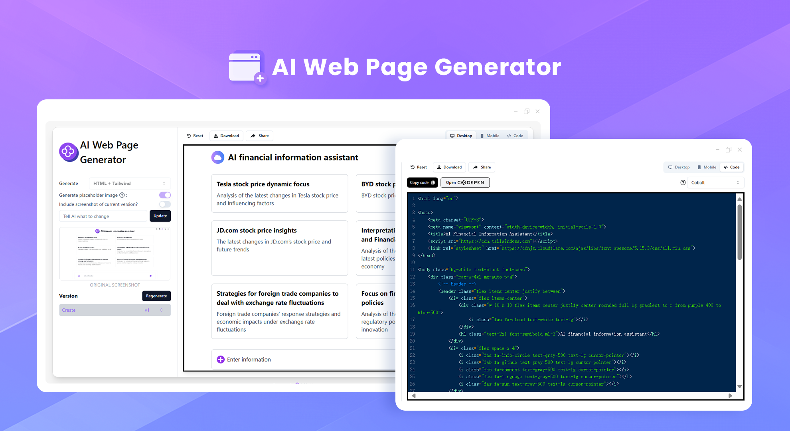
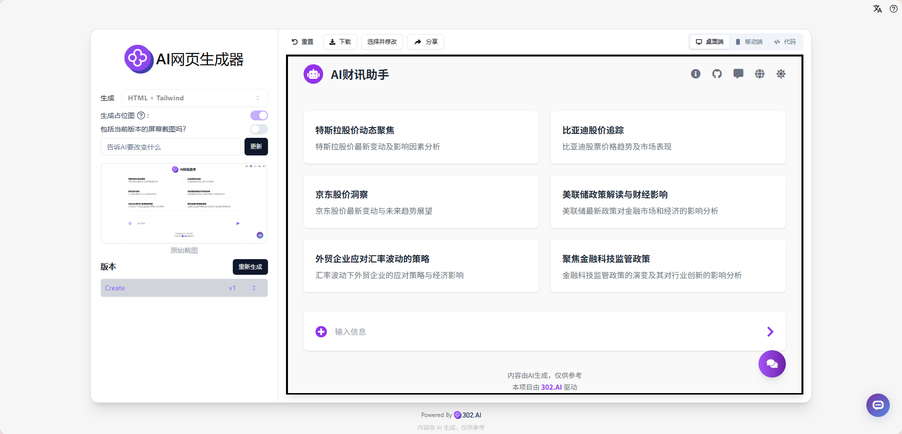
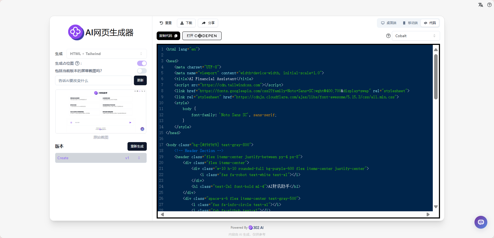
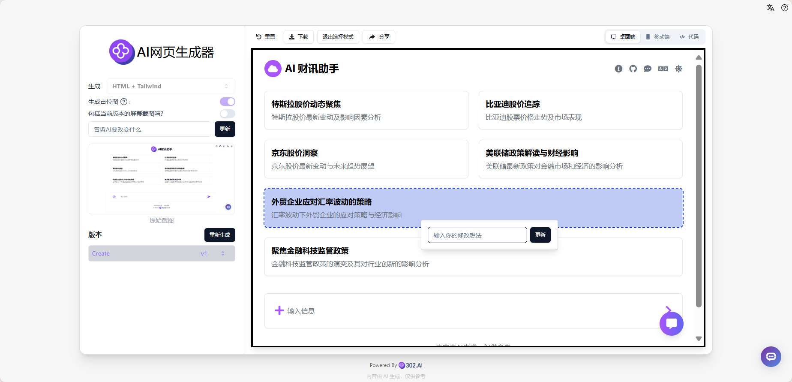

# 
 💻 AI Web Page Generator 🚀✨

AI Web Page Generator can generate front-end HTML files through AI large models by simply using natural language descriptions or providing a webpage screenshot. It supports the following tech stacks: Html+Tailwindcss, React+Tailwindcss, Bootstrap, Vue+Tailwindcss, Ionic+Tailwindcss, SVG. It can generate beautiful placeholder images through Dall-E 3, and also allows uploading existing HTML files for modification, supporting quick component-level adjustments with one click.

<a href="README_zh.md">中文</a> | <a href="README.md">English</a> | <a href="README_ja.md">日本語</a>

This is the open-source version of the [AI Web Page Generator](https://302.ai/en/tools/front/) from [302.AI](https://302.ai/en/). You can directly log in to 302.AI to use the online version with zero code and zero background, or modify and deploy it yourself according to your requirements.

## Interface Preview
Generate similar pages through natural language descriptions or webpage screenshots, with real-time desktop preview.

Generate front-end code based on webpage screenshots for desktop view.

Support various tech stacks and component libraries, with precise one-click component modifications.
   

Real-time mobile view preview available.
   

## Project Features
### 💻 Intelligent Code Generation
Support front-end code generation through natural language or screenshots, including various mainstream tech stacks.
### 🎯 Component-level Editing
Support precise positioning and modification of specific components to improve development efficiency.
### 🎨 Image Generation
Integrate Dall-E 3 for generating high-quality placeholder images.
### 🔄 Code Import/Export
Support importing existing HTML files for modification and exporting generated code.
### 🌍 Multi-language Support
- Chinese Interface
- English Interface
- Japanese Interface

## 🚩 Future Update Plans
- [ ] Support more front-end frameworks and component libraries
- [ ] Add more custom style options

## 🛠️ Tech Stack
- React
- Tailwind CSS
- Shadcn UI

## Development & Deployment
1. Clone project `git clone https://github.com/302ai/302_web_page_generator`
2. Install dependencies `npm`
3. Configure 302's API KEY (refer to .env.example)
4. Run project `npm run dev`
5. Build and deploy `docker build -t web_page_generator . && docker run -p 3000:80 web_page_generator`
6. Node version 20 or above required

## ✨ About 302.AI ✨
[302.AI](https://302.ai/en/) is an enterprise-oriented AI application platform that offers pay-as-you-go services, ready-to-use solutions, and an open-source ecosystem.✨
1. 🧠 Comprehensive AI capabilities: Incorporates the latest in language, image, audio, and video models from leading AI brands.
2. 🚀 Advanced application development: We build genuine AI products, not just simple chatbots.
3. 💰 No monthly fees: All features are pay-per-use, fully accessible, ensuring low entry barriers with high potential.
4. 🛠 Powerful admin dashboard: Designed for teams and SMEs - managed by one, used by many.
5. 🔗 API access for all AI features: All tools are open-source and customizable (in progress).
6. 💡 Powerful development team: Launching 2-3 new applications weekly with daily product updates. Interested developers are welcome to contact us.