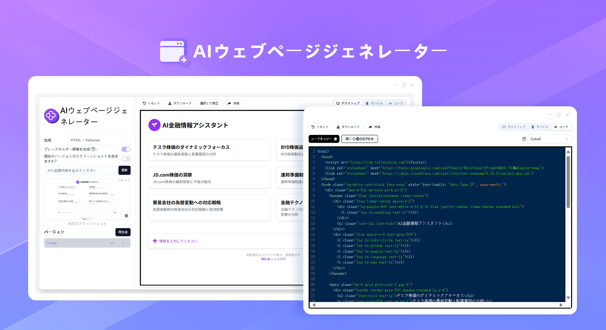
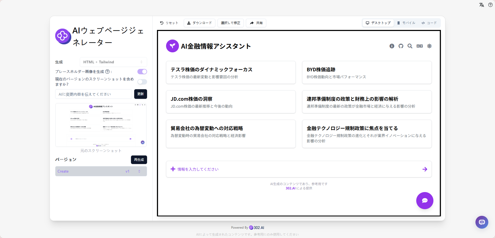
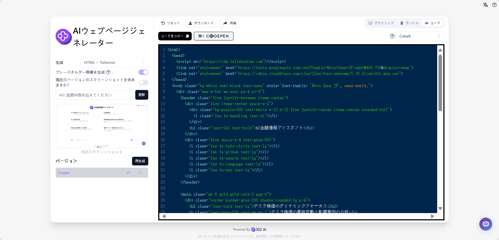
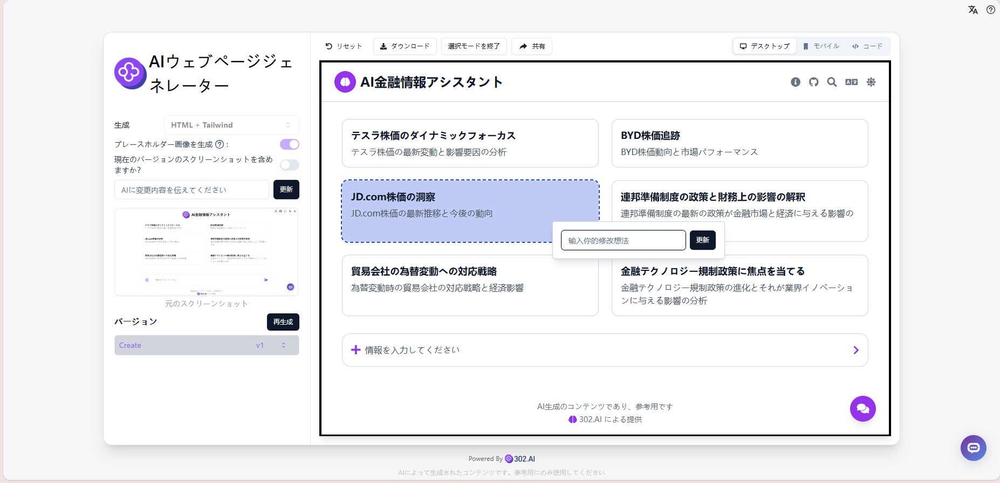
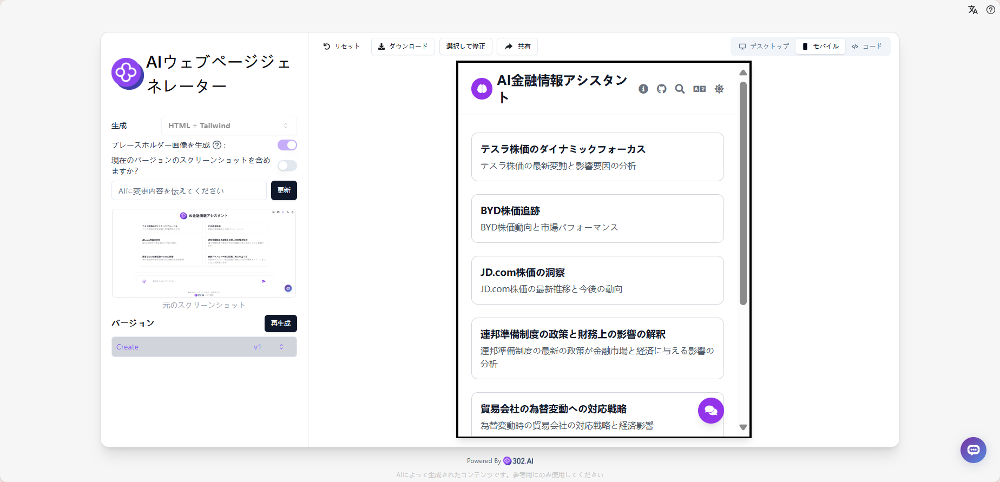

# 
 💻 AIウェブページジェネレーター 🚀✨

AIウェブページジェネレーターは、自然言語による説明やウェブページのスクリーンショットを提供するだけで、AI大規模モデルを通じてフロントエンドのHTMLファイルを生成できます。Html+Tailwindcss、React+Tailwindcss、Bootstrap、Vue+Tailwindcss、Ionic+Tailwindcss、SVGなどの技術スタックをサポートし、Dall-E 3で美しいプレースホルダー画像を生成できます。また、既存のHTMLファイルをアップロードして修正することもでき、ワンクリックでコンポーネントを選択して素早く調整することができます。

<a href="README_zh.md">中文</a> | <a href="README.md">English</a> | <a href="README_ja.md">日本語</a>

[302.AI](https://302.ai/ja/)の[PDF万能ツールボックス](https://302.ai/ja/tools/front/)のオープンソース版です。
302.AIに直接ログインすることで、コード不要、設定不要のオンライン体験が可能です。
あるいは、このプロジェクトをニーズに合わせてカスタマイズし、302.AIのAPI KEYを統合して、自身でデプロイすることもできます。

## インターフェースプレビュー
自然言語による説明やウェブページのスクリーンショットを通じて、AIが自動的に類似のページを生成し、デスクトップ表示をリアルタイムでプレビューできます。

ウェブページのスクリーンショットからデスクトップ表示用のフロントエンドコードを生成します。

様々な技術スタックとコンポーネントライブラリをサポートし、ワンクリックで正確なコンポーネントの修正と調整が可能です。
   

モバイル表示のリアルタイムプレビューが可能です。
       

## プロジェクトの特徴
### 💻 インテリジェントコード生成
自然言語やスクリーンショットを通じてフロントエンドコードを生成し、様々な主要な技術スタックをサポートします。
### 🎯 コンポーネントレベルの編集
特定のコンポーネントを正確に特定して修正し、開発効率を向上させます。
### 🎨 画像生成
Dall-E 3を統合して高品質なプレースホルダー画像を生成します。
### 🔄 コードのインポート/エクスポート
既存のHTMLファイルをインポートして修正し、生成したコードをエクスポートすることができます。
### 🌍 多言語サポート
- 中国語インターフェース
- 英語インターフェース
- 日本語インターフェース

## 🚩 将来のアップデート計画
- [ ] より多くのフロントエンドフレームワークとコンポーネントライブラリのサポート
- [ ] より多くのカスタムスタイルオプションの追加

## 🛠️ 技術スタック
- React
- Tailwind CSS
- Shadcn UI

## 開発とデプロイ
1. プロジェクトのクローン `git clone https://github.com/302ai/302_web_page_generator`
2. 依存関係のインストール `npm`
3. 302のAPI KEYを設定 (.env.exampleを参照)
4. プロジェクトの実行 `npm run dev`
5. ビルドとデプロイ `docker build -t web_page_generator . && docker run -p 3000:80 web_page_generator`
6. Node バージョン20以上が必要

## ✨ 302.AIについて ✨
[302.AI](https://302.ai/ja/)は企業向けのAIアプリケーションプラットフォームであり、必要に応じて支払い、すぐに使用できるオープンソースのエコシステムです。✨
1. 🧠 包括的なAI機能：主要AIブランドの最新の言語、画像、音声、ビデオモデルを統合。
2. 🚀 高度なアプリケーション開発：単なるシンプルなチャットボットではなく、本格的なAI製品を構築。
3. 💰 月額料金なし：すべての機能が従量制で、完全にアクセス可能。低い参入障壁と高い可能性を確保。
4. 🛠 強力な管理ダッシュボード：チームやSME向けに設計 - 一人で管理し、多くの人が使用可能。
5. 🔗 すべてのAI機能へのAPIアクセス：すべてのツールはオープンソースでカスタマイズ可能（進行中）。
6. 💪 強力な開発チーム：大規模で高度なスキルを持つ開発者集団。毎週2-3の新しいアプリケーションをリリースし、毎日製品更新を行っています。才能ある開発者の参加を歓迎します。