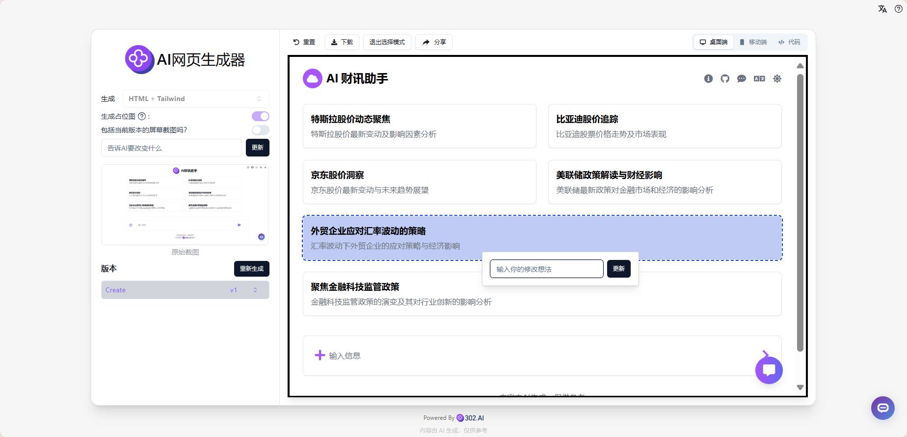
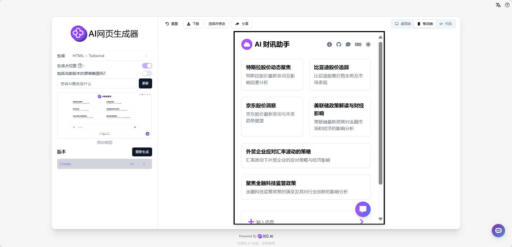

# 
 💻 AI 网页生成器 🚀✨

AI网页生成器只需通过自然语言描述或提供一张网页截图，即可通过AI大模型生成前端HTML文件，支持以下技术栈：Html+Tailwindcss, React+Tailwindcss, Bootstrap, Vue+Tailwindcss, Ionic+Tailwindcss, SVG，可通过Dall-E 3生成好看的占位图，还可以上传自己已有的HTML文件进行修改，支持一键选择组件快速针对该组件进行调整。

<a href="README_zh.md">中文</a> | <a href="README.md">English</a> | <a href="README_ja.md">日本語</a>

来自[302.AI](https://302.ai)的[AI 网页生成器](https://302.ai/product/detail/21)的开源版本。你可以直接登录302.AI，零代码零配置使用在线版本。或者对本项目根据自己的需求进行修改，传入302.AI的API KEY，自行部署。

## 界面预览
通过自然语言描述或上传网页截图，AI自动分析并生成相似页面，实时预览桌面端效果。

根据网页截图生成桌面端效果对应的前端代码。

支持多种技术栈和组件库，可一键选择组件进行精确修改和调整。
   

可实时预览移动端效果。
   

## 项目特性
### 💻 智能代码生成
支持通过自然语言或截图生成前端代码，包括多种主流技术栈。
### 🎯 组件级编辑
支持精确定位并修改特定组件，提高开发效率。
### 🎨 图片生成
集成Dall-E 3用于生成高质量的占位图。
### 🔄 代码导入导出
支持导入已有HTML文件进行修改，并导出生成的代码。
### 🌍 多语言支持
  - 中文界面
  - English Interface
  - 日本語インターフェース

## 🚩 未来更新计划
- [ ] 支持更多前端框架和组件库
- [ ] 添加更多自定义样式选项

## 🛠️ 技术栈
- React
- Tailwind CSS
- Shadcn UI

## 开发&部署
1. 克隆项目 `git clone https://github.com/302ai/302_web_page_generator`
2. 安装依赖 `npm`
3. 配置302的API KEY 参考.env.example
4. 运行项目 `npm run dev`
5. 打包部署 `docker build -t web_page_generator . && docker run -p 3000:80 web_page_generator`
6. node版本为20及以上

## ✨ 302.AI介绍 ✨
[302.AI](https://302.ai)是一个按需付费的AI应用平台，为用户解决AI用于实践的最后一公里问题。
1. 🧠 集合了最新最全的AI能力和品牌，包括但不限于语言模型、图像模型、声音模型、视频模型。
2. 🚀 在基础模型上进行深度应用开发，我们开发真正的AI产品，而不是简单的对话机器人
3. 💰 零月费，所有功能按需付费，全面开放，做到真正的门槛低，上限高。
4. 🛠 功能强大的管理后台，面向团队和中小企业，一人管理，多人使用。
5. 🔗 所有AI能力均提供API接入，所有工具开源可自行定制（进行中）。
6. 💡 强大的开发团队，每周推出2-3个新应用，产品每日更新。有兴趣加入的开发者也欢迎联系我们
